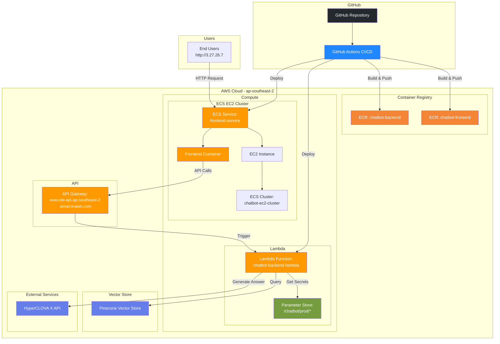
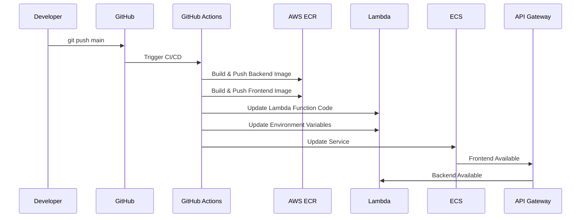

# AWS Architecture

## 전체 시스템 아키텍처



## 컴포넌트별 상세 정보

### 1. GitHub Actions (CI/CD)
- **Repository**: chatbot
- **Triggers**: Push to main branch
- **Actions**:
  - Build Docker images
  - Push to ECR
  - Deploy to Lambda
  - Deploy to ECS

### 2. AWS Lambda (Backend)
- **Function Name**: `chatbot-backend-lambda`
- **Runtime**: Python 3.12
- **Memory**: 1024 MB
- **Timeout**: 300 seconds
- **Entry Point**: `main.lambda_handler`
- **Environment Variables**:
  ```
  ENVIRONMENT=production
  LOG_LEVEL=INFO
  ALLOWED_ORIGINS=http://localhost:3000,http://localhost:3001,http://127.0.0.1:3000,http://3.27.26.7
  PINECONE_API_KEY_PARAM=/chatbot/prod/PINECONE_API_KEY
  PINECONE_INDEX_NAME_PARAM=/chatbot/prod/PINECONE_INDEX_NAME
  HYPERCLOVA_API_KEY_PARAM=/chatbot/prod/HYPERCLOVA_API_KEY
  ```

### 3. API Gateway
- **URL**: `https://qf8ki1v4e9.execute-api.ap-southeast-2.amazonaws.com/prod`
- **Integration**: Lambda Proxy Integration
- **Methods**: POST /chat
- **CORS**: Enabled (ALLOWED_ORIGINS)

### 4. ECS (Frontend)
- **Cluster**: `chatbot-ec2-cluster`
- **Service**: `frontend-service`
- **Task Definition**: `frontend-task-definition`
- **Container**: `frontend-container`
- **Port**: 3000
- **Public IP**: 3.27.26.7

### 5. EC2 Instance
- **Type**: EC2 (can be t3.medium, t3.large, etc.)
- **Region**: ap-southeast-2
- **Role**: Hosts ECS tasks

### 6. ECR (Container Registry)
- **Backend Image**: `chatbot-backend`
- **Frontend Image**: `chatbot-frontend`
- **Registry**: `144618663232.dkr.ecr.ap-southeast-2.amazonaws.com`

### 7. Parameter Store
- **Path**: `/chatbot/prod/*`
- **Secrets**:
  - PINECONE_API_KEY
  - PINECONE_INDEX_NAME
  - HYPERCLOVA_API_KEY
- **Access**: Lambda has read permissions

### 8. External Services
- **Pinecone**: Vector database for course information
- **HyperCLOVA X**: AI chatbot engine

## 네트워크 흐름

```
User Browser
    ↓
http://3.27.26.7:3000 (Frontend on EC2/ECS)
    ↓
HTTPS POST https://qf8ki1v4e9.execute-api.ap-southeast-2.amazonaws.com/prod/chat
    ↓
API Gateway
    ↓
Lambda Function (Backend)
    ↓
    ├→ Parameter Store (Get API Keys)
    ├→ Pinecone (Search Vectors)
    └→ HyperCLOVA X (Generate Response)
    ↓
Response back to Frontend
    ↓
Display to User
```

## 보안

### IAM Roles & Policies
- **Lambda Execution Role**: 
  - SSM Parameter Store read permissions
  - CloudWatch Logs permissions
  - VPC access (if needed)

- **ECS Task Role**: 
  - ECR pull permissions
  - CloudWatch Logs

### CORS 설정
- **Allowed Origins**: 
  - `http://localhost:3000`
  - `http://localhost:3001`
  - `http://127.0.0.1:3000`
  - `http://3.27.26.7` (Production)

### Secrets Management
- Secrets stored in AWS Parameter Store
- Lambda retrieves at runtime
- No secrets in code or environment variables

## 배포 프로세스



## 비용 최적화

### Lambda
- **Cold Start**: ~2-3 seconds (한국어 모델 로딩)
- **Warm Start**: <100ms
- **Memory**: 1024 MB (낮추면 cold start 시간 증가)

### ECS
- **Reserved Capacity**: EC2 Instance
- **Auto Scaling**: Disabled (Single instance)

### ECR
- **Image Layers**: Cached for faster builds
- **Lifecycle Policy**: Old images cleanup

## 모니터링

### CloudWatch Metrics
- Lambda: Duration, Memory Usage, Errors
- ECS: CPU, Memory, Task Count
- API Gateway: Request Count, Latency, 4xx/5xx Errors

### CloudWatch Logs
- Lambda Logs: `/aws/lambda/chatbot-backend-lambda`
- ECS Logs: Frontend container logs

## 장애 대응

### Lambda Issues
1. Check CloudWatch Logs
2. Verify Parameter Store access
3. Check API Gateway integration
4. Verify CORS configuration

### ECS Issues
1. Check EC2 instance health
2. Verify container logs
3. Check ECS service events
4. Verify task definition

## 향후 개선 사항

1. **CDN**: CloudFront for frontend static assets
2. **WAF**: Web Application Firewall for API Gateway
3. **CloudWatch Alarms**: Automated alerting
4. **Auto Scaling**: ECS task auto-scaling
5. **VPC**: Lambda in VPC for enhanced security
6. **CloudFront**: Custom domain with SSL

